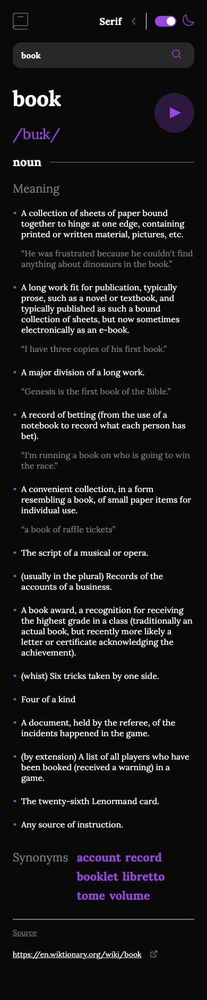
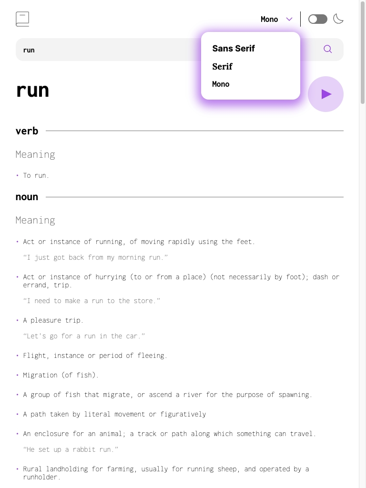

# Frontend Mentor - Dictionary web app solution

This is a solution to the [Dictionary web app challenge on Frontend Mentor](https://www.frontendmentor.io/challenges/dictionary-web-app-h5wwnyuKFL). Frontend Mentor challenges help you improve your coding skills by building realistic projects.

## Table of contents

- [Frontend Mentor - Dictionary web app solution](#frontend-mentor---dictionary-web-app-solution)
  - [Table of contents](#table-of-contents)
  - [Overview](#overview)
    - [The challenge](#the-challenge)
  - [My process](#my-process)
    - [Notes](#notes)
    - [Built with](#built-with)
    - [What I learned](#what-i-learned)
    - [Continued development](#continued-development)

**Note: Delete this note and update the table of contents based on what sections you keep.**

## Overview

### The challenge

Users should be able to:

- Search for words using the input field
- See the Free Dictionary API's response for the searched word
- See a form validation message when trying to submit a blank form
- Play the audio file for a word when it's available
- Switch between serif, sans serif, and monospace fonts
- Switch between light and dark themes
- View the optimal layout for the interface depending on their device's screen size
- See hover and focus states for all interactive elements on the page
- **Bonus**: Have the correct color scheme chosen for them based on their computer preferences.

<details>
  <summary><h3>Screenshots</h3></summary>
  
  
</details>

- Solution URL: [https://github.com/Flow-Fly/frontendmentor.io/tree/dictionary](https://github.com/Flow-Fly/frontendmentor.io/tree/dictionary)
- Live Site URL: [https://frontendmentor-flow-dictionary.netlify.app/](https://frontendmentor-flow-dictionary.netlify.app/)

## My process

This is part of a serie of challenges I indulge myself to learn TypeScript, Lit (Web Components) and get better at CSS generally speaking.

### Notes

Best view using a Chromium browser.
Sadly Firefox does not support:

```css
:host-context(selector) {
}
/* To infer styling inside a web-components, based on the "context" he is in
    Typically, here, the dark / light theme.
*/
```

```css
:has(selector) {
}
/* It is available under flags but still not fully supported */
```

### Built with

- Semantic HTML5 markup
- CSS custom properties
- Flexbox
- CSS Grid
- Mobile-first workflow
- [Lit](https://lit.dev/) - JS Web Component library
- TypeScript

### What I learned

Just starting with webcomponents and TypeScript:

- Web components encapsulation can be painful
  - I added a lot of styling that I eventually add to start over (in a not so clean way atm)
- TypeScript is awesome
- CustomEvent's are fun to play with (Learned that I can't re-route a dispatched Event, had to clone it then dispatch again.)
- Need to improve on the overall structure of my web-components, the displayer one is way too huge and need some rework (just wanted to get it finished for now :) )
- I still have a lot to improve on CSS wise.
- Web components are a lot of fun.
  - It would definitely have been easier with a framework like Vue / React
- Loved working using [Responsively](https://responsively.app/)

### Continued development

Cleanup the CSS and some Components, add some animations and improve UX :

- Input reset, quite simple but forgot to add that.
- Closing the font-selector when clicking out of the box, for now we have to click on the label.
- Make sure the font-selector is accesible (for now only the theme selector is)
