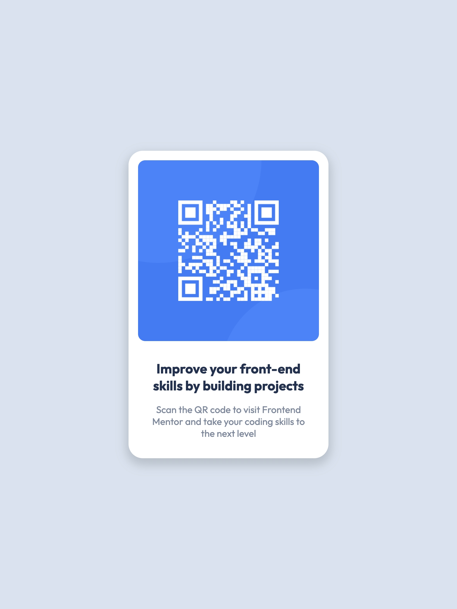

# Frontend Mentor - QR code component solution

This is a solution to the [QR code component challenge on Frontend Mentor](https://www.frontendmentor.io/challenges/qr-code-component-iux_sIO_H). Frontend Mentor challenges help you improve your coding skills by building realistic projects.

## Table of contents

- [Frontend Mentor - QR code component solution](#frontend-mentor---qr-code-component-solution)
  - [Table of contents](#table-of-contents)
  - [Overview](#overview)
    - [Screenshot](#screenshot)
    - [Links](#links)
    - [Built with](#built-with)
    - [What I learned](#what-i-learned)

## Overview

### Screenshot

<picture>
<legend>Phone</legend>

</picture>
<picture>
<legend>iPad and bigger</legend>

</picture>

### Links

- [Live Site URL](https://webc-qrcode.netlify.app/)

### Built with

- Semantic HTML5 markup
- CSS custom properties
- Flexbox
- CSS Grid
- Mobile-first workflow
- Web components
- Typescript
- [Lit](https://lit.dev)

### What I learned

This is part of a "built with web-components" idea I am challenging myself with.
I am going through some frontend mentor challenges (simple one first), to build web components using Typescript.
